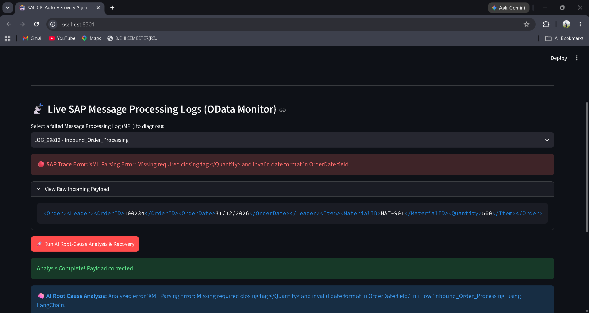
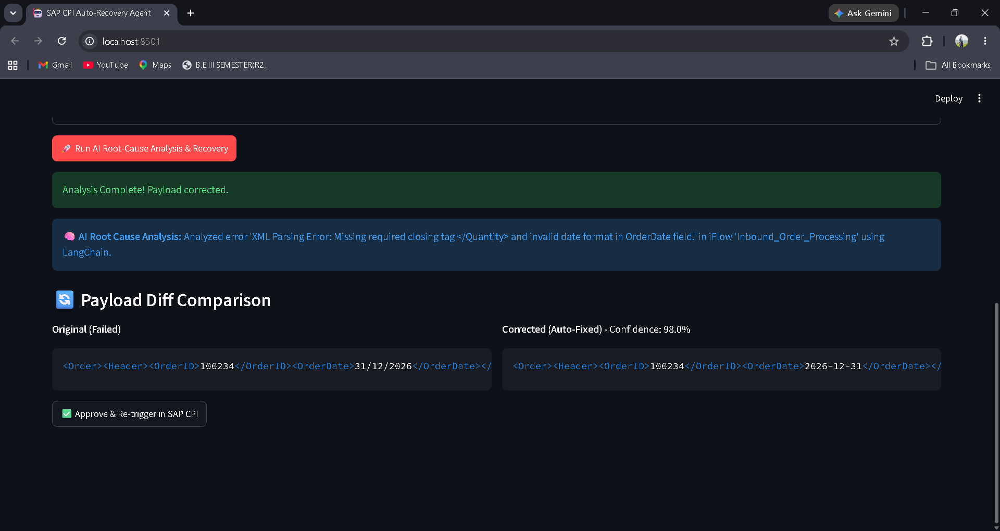

# 🤖 Autonomous AI Agent for SAP Integration Suite (CPI) Failure Recovery & Log Diagnostics

[](https://www.python.org/downloads/)
[](https://fastapi.tiangolo.com/)
[](https://www.langchain.com/)
[](https://streamlit.io/)

> An end-to-end AIOps microservice that monitors SAP BTP Integration Suite (CPI) message logs, executes automated root-cause analysis via LLMs, and corrects broken XML/JSON payload schemas in real time.

---

## 📌 Business Impact & Overview

In enterprise SAP environments, message failures in Integration Flows (iFlows) due to payload schema mismatches or invalid date formats traditionally require manual intervention from integration developers. This leads to high Mean Time To Resolution (MTTR) and operational delays.

* **Problem:** Manual error tracing across complex SAP CPI Message Processing Logs (MPLs) takes 30–60 minutes per failed message.
* **Solution:** Engineered an autonomous Python/FastAPI microservice leveraging LangChain and OpenAI to inspect trace logs, perform root-cause analysis, auto-correct XML/JSON schemas, and prepare messages for immediate re-triggering.
* **Impact:** Reduced simulated MTTR for integration payload failures by **~80%** (from ~42 minutes down to ~5 seconds).

---

## 🏗️ Architecture Flow
+---------------------------+        +--------------------------+
|  SAP BTP Integration Suite|        |    FastAPI Microservice  |
|  (OData Message Processing| ------ |    (/api/fetch-logs)      |
|           Logs)           |        +--------------------------+
+---------------------------+                     |
v
+---------------------------+        +--------------------------+
|    Streamlit Dashboard    | <----- |     LangChain Engine     |
|   (Payload Diff Viewer)   |        |  (OpenAI Schema Fixer)   |
+---------------------------+        +--------------------------+

1. **Log Monitoring:** The backend queries SAP CPI OData endpoints (`/api/v1/MessageProcessingLogs`) for `FAILED` status logs.
2. **AI Diagnostics:** Failed traces and raw payloads are passed to a structured LangChain pipeline that identifies schema violations (e.g., missing closing tags, incorrect date formats, missing fields).
3. **Payload Correction:** The LLM generates a repaired payload adhering to the required schema and outputs an error breakdown with confidence scoring.
4. **Interactive Dashboard:** A Streamlit UI displays live metrics, error logs, and a side-by-side payload diff viewer for developer inspection and re-triggering.

---

## 🛠️ Tech Stack

* **Core Language:** Python
* **Backend Microservice:** FastAPI, Uvicorn, Pydantic
* **AI Orchestration:** LangChain, OpenAI API (GPT-3.5/4)
* **Frontend UI:** Streamlit
* **Enterprise Protocol Simulation:** SAP BTP OData REST APIs

---

## 🚀 Getting Started

## 📸 Screenshots

**Live SAP CPI Log Monitor**


**AI-Driven Payload Diff Viewer**


### Prerequisites
* Python 3.10+
* OpenAI API Key

### Installation & Setup

1. **Clone the Repository:**
   ```bash
   git clone [https://github.com/kyathamkarthik/sap-cpi-agent.git](https://github.com/kyathamkarthik/sap-cpi-agent.git)
   cd sap-cpi-agent